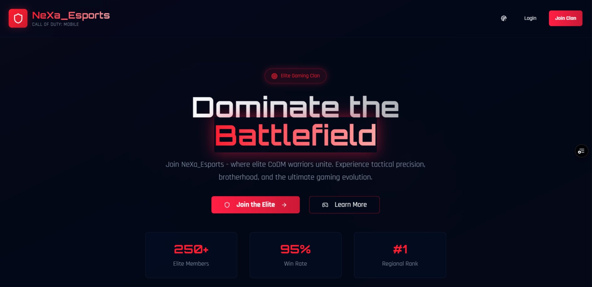
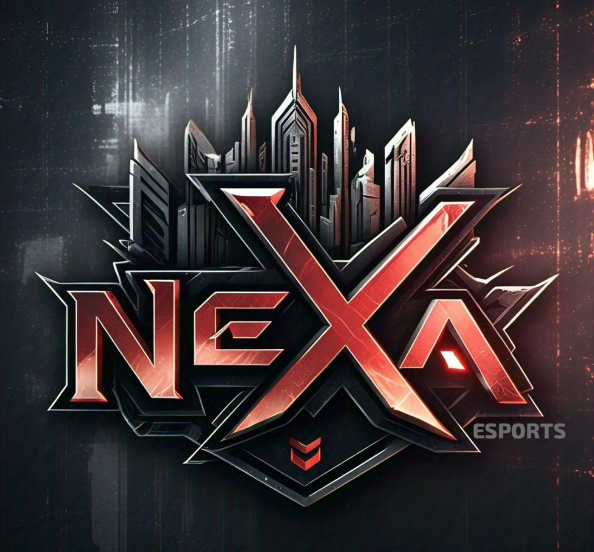

# Nexa_Esports 🎮

**Nexa_Esports** is a clan-driven esports platform built for gamers, teams, and competitive communities. This MVP empowers users to create or join clans, engage in clan-based activities, and compete in scrims or ranked tournaments — all within a sleek, mobile-optimized dashboard powered by **TailwindCSS** and **ShadCN UI**.

> “Give gamers an identity, a team, a home — then build the war room around it.”

---

## 🚀 Features

- 🔐 Role-based Authentication (Sign Up, Login, Reset Password)
- 🧑‍🤝‍🧑 Clan System: Create, Join, or Manage Clans
- 📊 Personalized Dashboards: Real-time clan activity, stats & announcements
- 🧭 Clan “Base”: Media galleries, event scheduling, rosters, match setup
- 🛠 Admin Dashboard: Users, Clans, Scrims, Announcements, Disputes
- 🖼 ShadCN UI Components: Stylish, modern, gamer-centric interface
- ⚙️ Supabase Integration for auth, storage, and database
- 🌙 Responsive Dark Mode for PC and mobile

---

## 📸 Screenshots

> *(Replace with real screenshots later)*




---

## 🧱 Tech Stack

- **Frontend**: React + Vite + TypeScript
- **Styling**: Tailwind CSS + ShadCN UI
- **Backend**: Supabase (auth, DB, storage)
- **Routing**: React Router DOM
- **Deployment**: Vercel (via `vercel.json`)
- **State/Logic**: Custom React hooks & context

---

## 📦 Installation

```bash
# 1. Clone the repo
git clone https://github.com/your-username/nexa-esports.git

# 2. Navigate into the project
cd nexa-esports

# 3. Install dependencies
npm install

# 4. Start dev server
npm run dev
````

---

## 🔑 Environment Setup

> Create a `.env` file and configure Supabase keys

```env
VITE_SUPABASE_URL=your_supabase_url
VITE_SUPABASE_ANON_KEY=your_anon_key
```

---

## 📁 Project Structure Highlights

```
├── src
│   ├── pages              # Auth, Admin, Clan, Dashboard pages
│   ├── components         # UI components (Sidebar, ThemeToggle, etc.)
│   ├── hooks              # Custom logic (loadouts, stats, auth)
│   ├── contexts           # Theme & Auth context
│   └── integrations       # Supabase client + types
├── public                 # Favicon, logo, thumbnails
├── supabase               # DB migrations, config
├── tailwind.config.ts     # Styling config
└── vite.config.ts         # Vite app config
```

---

## 🧪 Development Scripts

```bash
# Start dev server
npm run dev

# Format code
npm run format

# Type-check
npm run typecheck

# Build for production
npm run build
```

---

## 👑 Admin Features

Accessible to platform superusers:

* Manage Players, Clans, Loadouts
* Announcements & Notifications
* Scrim Scheduling + Results
* Dispute Management

---

## 🔐 Auth Pages Included

* `/auth/signup`
* `/auth/login`
* `/auth/forgot-password`
* `/auth/reset-password`
* `/auth/email-confirmation`

---

## 📬 Contact & Contribution

Want to contribute or test it?

* 🧙 Built by [@codegallantx](https://github.com/codegallantx)
* 🛠 Pull requests welcome!
* 👀 DM for onboarding, issue reporting, or clan requests

---

## 🪪 License

MIT — free to fork, modify, or build on.
Give credit if you clone the whole war room ⚔️

---

## 🌐 Demo Link

> [Live App](https://nexa-esports.vercel.app)
